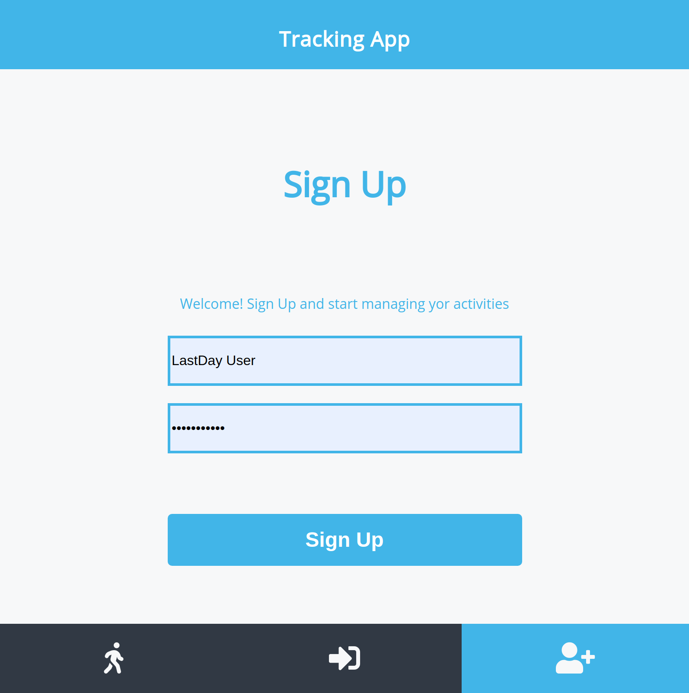
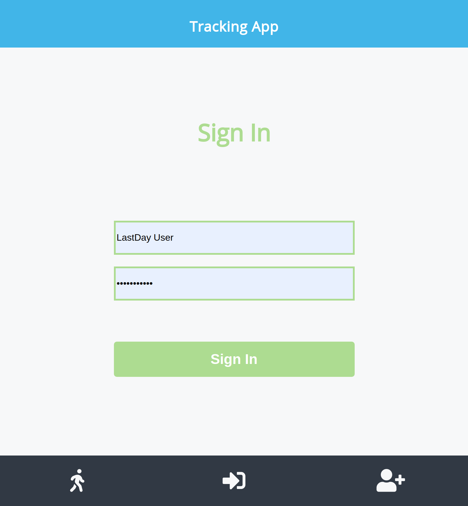
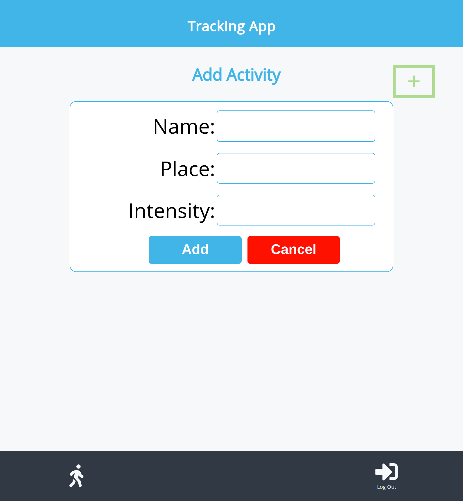
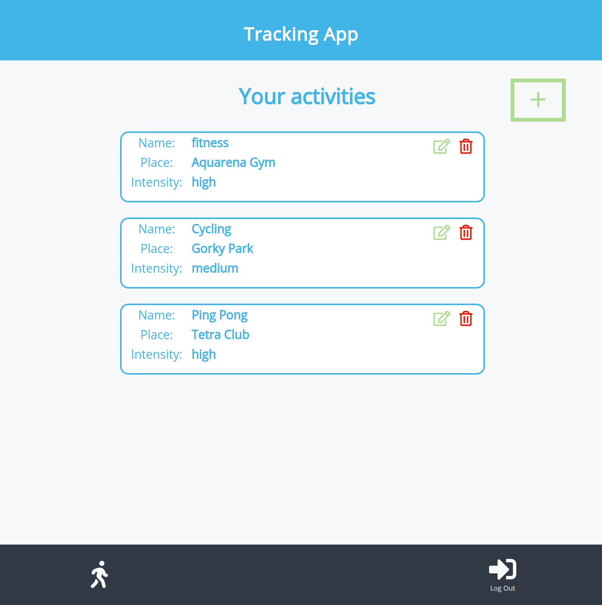
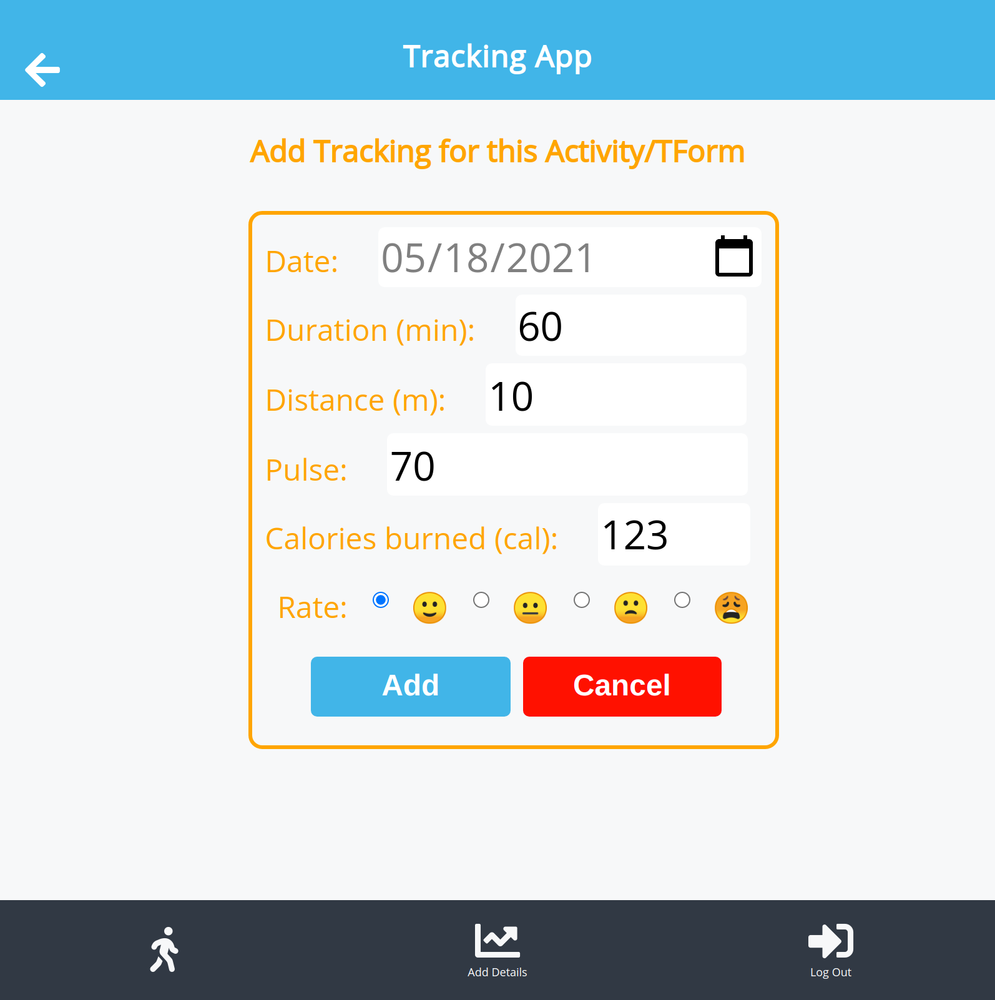

# app-front

[Live Demo](https://app-front.netlify.app)1image.png

### Author

👤 **Oksana Petrova**

- GitHub: [@github/Laguna1](https://github.com/Laguna1)
- Linkedin: [linkedin/OksanaPetrova](https://www.linkedin.com/in/oksana-petrova/)
- Twitter: [@OksanaP48303303](https://twitter.com/OksanaP48303303)

### 🤝 Contributing

Contributions, issues and feature requests are welcome!

Feel free to check the [issues page](https://github.com/Laguna1/api-front/issues)

### Show your support

Give a ⭐️ if you like this project!

### Acknowledgments

You can access all the design info - color, typography, layouts - at this link:

### 📝 License
This project is [MIT](https://github.com/Laguna1/api-front/LICENSE) licensed.

